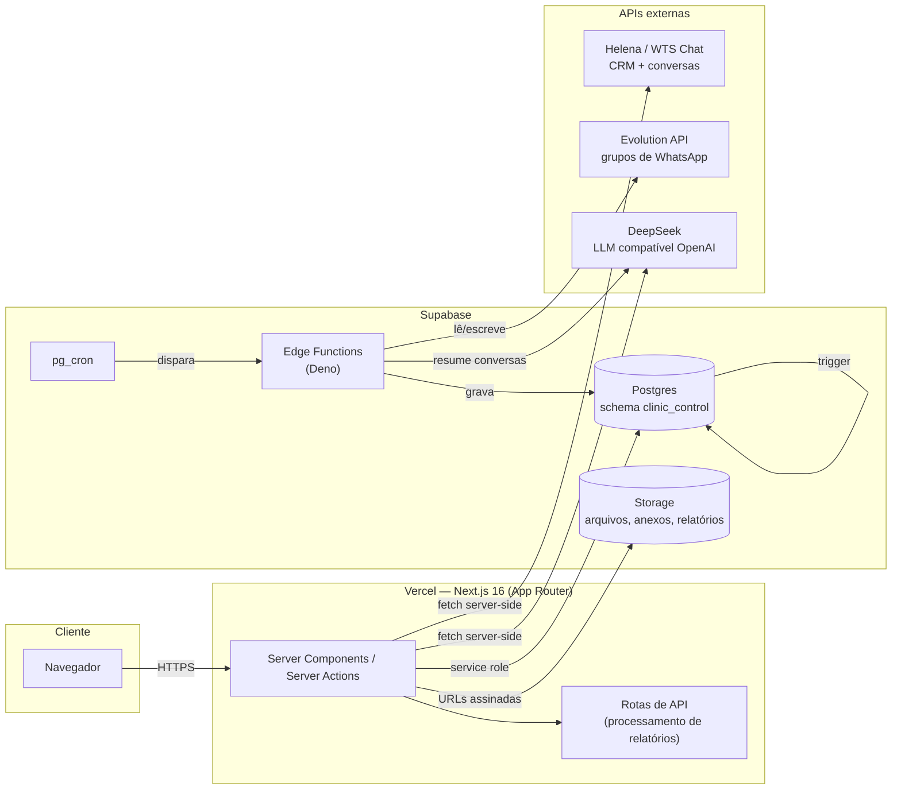
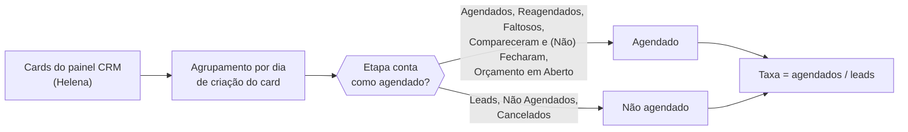
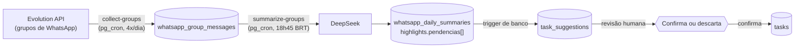
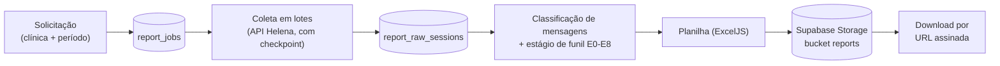
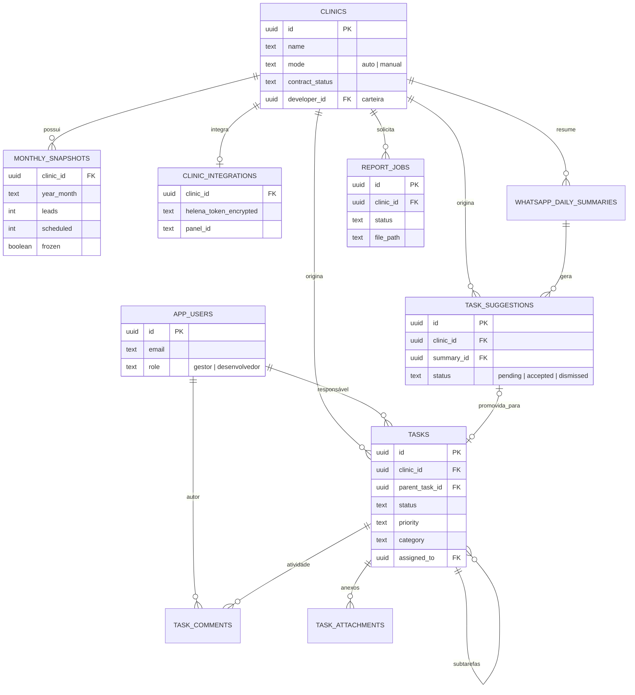
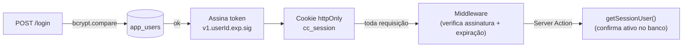

# Clinic Control

Plataforma interna da Contact.IA para gestão da carteira de clínicas odontológicas atendidas por agentes de IA no WhatsApp. Centraliza métricas de funil de conversão, acompanhamento de atendimento (IA e humano), resumos diários gerados por IA, relatórios de conversas, tarefas e o cadastro/configuração de cada clínica.

Aplicação privada de uso interno — não é um produto open source e não aceita contribuições externas.

## Sumário

- [Visão geral](#visão-geral)
- [Arquitetura](#arquitetura)
- [Stack tecnológica](#stack-tecnológica)
- [Módulos e funcionalidades](#módulos-e-funcionalidades)
- [Fluxos de dados principais](#fluxos-de-dados-principais)
- [Modelo de dados](#modelo-de-dados)
- [Autenticação e autorização](#autenticação-e-autorização)
- [Estrutura do repositório](#estrutura-do-repositório)
- [Configuração do ambiente](#configuração-do-ambiente)
- [Scripts disponíveis](#scripts-disponíveis)
- [Testes](#testes)
- [Deploy](#deploy)
- [Roadmap](#roadmap)

## Visão geral

Cada clínica atendida pela Contact.IA opera em um de dois modos:

- **Automático** — possui uma conta na Helena (plataforma de CRM/chat que hospeda o agente de IA no WhatsApp). O funil de leads, agendamentos e o histórico de conversas são lidos ao vivo da API da Helena.
- **Manual** — não possui integração; os números do funil (leads, agendados) são lançados manualmente todo mês pela equipe.

A plataforma consolida esses dois modos numa única visão de carteira: taxa de conversão por clínica, evolução mês a mês, mapa geográfico, status de saúde da conta, tempo de resposta no WhatsApp, resumos diários por IA e um sistema de tarefas que recebe pendências identificadas automaticamente por esses resumos.

## Arquitetura



Pontos centrais dessa arquitetura:

- **Um único banco Postgres compartilhado** com outro sistema da organização; o Clinic Control vive isolado no schema `clinic_control` (nunca `public`).
- **Todo acesso ao banco a partir do Next.js passa por um client `service_role`** — não há RLS por usuário final porque a autenticação é própria (não usa Supabase Auth) e o controle de acesso é feito na camada de aplicação (server actions).
- **Coleta e resumo do WhatsApp rodam fora do runtime do Next.js**, em Edge Functions agendadas por `pg_cron`, porque são processos longos e periódicos (não cabem no ciclo de uma requisição HTTP).
- **Chamadas a LLM (DeepSeek) acontecem em dois lugares diferentes**: dentro da Edge Function de resumos diários (Deno) e diretamente em uma Server Action do Next.js (quebra de tarefas em subtarefas) — cada uma com sua própria credencial de ambiente.

## Stack tecnológica

| Camada | Tecnologia |
|---|---|
| Framework | Next.js 16 (App Router, Server Components, Server Actions, Turbopack) |
| Linguagem | TypeScript |
| UI | React 19, Tailwind CSS 4, Base UI (primitivos headless), lucide-react |
| Gráficos e mapas | Recharts, react-leaflet (tiles CARTO dark) |
| Banco de dados | Supabase Postgres (schema dedicado `clinic_control`) |
| Armazenamento de arquivos | Supabase Storage (buckets privados, acesso via URL assinada) |
| Processos agendados | Supabase Edge Functions (Deno) + `pg_cron` + `pg_net` |
| Autenticação | Própria — tabela `app_users` + cookie de sessão assinado (HMAC-SHA256) |
| Geração de planilhas | ExcelJS |
| Compactação de arquivos | JSZip |
| IA / LLM | DeepSeek (API compatível com OpenAI) |
| Testes | Vitest + Testing Library |
| Deploy | Vercel (auto-deploy a partir do branch `main`) |

## Módulos e funcionalidades

| Rota | Módulo | Descrição |
|---|---|---|
| `/` | Dashboard | KPIs da carteira, distribuição por faixa de status, ranking de clínicas, alertas de atenção vindos dos resumos de IA, progresso de onboarding, exportação CSV. |
| `/clinicas` | Clínicas | Cadastro, edição e busca. Provisionamento automático de conta na Helena ao criar uma clínica nova. |
| `/clinicas/[id]` | Perfil da clínica | Funil de conversão, taxa de agendamento dia a dia, agentes de IA (personas e estágios), repositório de arquivos, credenciais de formulário, relatório de conversas, tarefas da clínica. |
| `/mensal` | Grade mensal | Edição manual de leads/agendados por clínica (clínicas manuais) ou leitura ao vivo (clínicas automáticas). |
| `/comparativo` | Comparativo | Taxa de conversão mês a mês, multi-clínica, gráfico e tabela. |
| `/mapa` | Mapa | Geolocalização das clínicas coloridas por faixa de status. |
| `/whatsapp` | Gerenciador de grupos | Tempo de resposta humano por clínica, resumos diários por IA, saúde da instância Evolution, canais e operadores da Helena. |
| `/tarefas` | Tarefas | Gestão de tarefas da carteira — ver detalhes abaixo. |
| `/churns` | Churns | Registro de desligamento de clínicas, motivos, receita perdida. |
| `/helena` | Contas Helena | Visão consolidada de todas as contas do parceiro na Helena, vinculadas ou não a uma clínica. |
| `/configuracoes` | Configurações | Faixas de status, keywords do relatório de conversas, catálogo de categorias/checklist, usuários e papéis (carteira). |

### Relatório de conversas

Job assíncrono por clínica e período: coleta as conversas da API da Helena em lotes (com checkpoint, retomável entre execuções), classifica cada mensagem (IA, paciente, humano ou sistema), estima o estágio de funil de vendas (E0 a E8, por palavras-chave configuráveis) e gera uma planilha Excel de três abas (resumo executivo, conversas e funil), disponível para download por link assinado.

### Tarefas

Sistema completo de gestão de pendências da carteira, com escopo por carteira (desenvolvedor vê as tarefas das próprias clínicas; gestor vê todas):

- Criação manual ou automática — os resumos diários de IA identificam pendências, que entram numa fila de sugestões revisável (confirma ou descarta, nunca cria direto). A sugestão não é gerada se já existe uma tarefa aberta parecida na mesma clínica (deduplicação por similaridade de texto, `pg_trgm`).
- Categoria, prioridade, responsável, prazo, clínica vinculada (opcional). A prioridade sugerida vem da severidade do resumo que originou a pendência (severidade alta → tarefa urgente).
- Subtarefas reais (não um checklist): a descrição de uma tarefa pode ser enviada ao DeepSeek, que propõe uma quebra em passos menores; a lista é revisada antes de virar tarefas de fato.
- Anexos de arquivo por tarefa.
- Linha do tempo de atividade unificando comentários manuais e o histórico automático de mudança de status.
- Visualização em lista ou em board Kanban (arrastar e soltar entre colunas de status).

## Fluxos de dados principais

### Funil de agendamento (clínicas automáticas)



A taxa é cumulativa: um card avança uma única etapa por vez no Kanban da Helena, então contar exclusivamente quem está parado em "Agendados" subestima a conversão real de quem já avançou no funil dentro do mesmo mês.

### Resumos diários por IA → sugestão de tarefa



Cada resumo recebe no prompt um digest do dia anterior (para o modelo notar continuidade de problemas) e classifica a severidade do dia (`baixa`/`media`/`alta`), que define a prioridade sugerida da tarefa. O consumo de tokens de cada chamada de IA (resumo diário, quebra de subtarefas etc.) é registrado em `ai_usage_log`, alimentando um card de custo estimado em Configurações (preços em `src/lib/ai-usage/pricing.ts`).

### Job de relatório de conversas



## Modelo de dados

Todas as tabelas vivem no schema `clinic_control` de um projeto Supabase compartilhado com outro sistema (o schema `public` não pertence a este projeto). O diagrama abaixo cobre as entidades centrais; o schema completo tem mais de 30 migrations incrementais em `supabase/migrations/`.



Domínios de tabelas por área:

| Área | Tabelas principais |
|---|---|
| Carteira e usuários | `clinics`, `app_users`, `user_invites` |
| Integração Helena | `clinic_integrations`, `helena_accounts`, `clinic_provisioning` |
| Funil e status | `monthly_snapshots`, `status_rules`, `funnel_steps` |
| Agentes de IA e arquivos | `clinic_agents`, `agent_stages`, arquivos no Storage |
| WhatsApp | `whatsapp_groups`, `whatsapp_group_messages`, `whatsapp_team_members`, `whatsapp_daily_summaries`, `evolution_health_checks` |
| Relatório de conversas | `report_jobs`, `report_raw_sessions`, `report_keywords` |
| Tarefas | `tasks`, `task_suggestions`, `task_attachments`, `task_comments` |
| IA e segurança | `ai_usage_log` (consumo de tokens/custo), `login_attempts` (rate limit de login) |
| Outros | `clinic_churns`, `check_items`, `clinic_checks`, `form_credentials` |

## Autenticação e autorização

A aplicação não usa o Supabase Auth. A sessão é resolvida por uma tabela própria (`app_users`, com hash bcrypt de senha) e um cookie HTTP-only assinado com HMAC-SHA256 (`src/lib/auth/token.ts`), validado tanto no middleware (assinatura e expiração, sem consulta ao banco) quanto nas Server Actions (usuário existe e está ativo).

O login (`src/lib/auth/actions.ts`) tem rate limit por e-mail (bloqueio após 8 falhas em 15 min, via tabela `login_attempts`), roda `bcrypt.compare` mesmo quando o e-mail não existe (contra um hash descartável) para não vazar por timing quais e-mails são válidos, e as senhas temporárias de reset usam RNG criptográfico com ~40 bits de entropia.



As Server Actions acessam o banco por um client de service role que **ignora o RLS** — todo usuário autenticado é staff interno de confiança, e a autorização é feita em nível de aplicação. Existem dois papéis:

- **gestor** — acesso irrestrito.
- **desenvolvedor** — por padrão enxerga apenas as clínicas em que consta como responsável (`clinics.developer_id`), além de tarefas atribuídas a ele. Esse recorte ("escopo de carteira") é um **filtro de visão** aplicado nas páginas com dado por clínica (dashboard, mensal, comparativo, churns, gerenciador de grupos e tarefas), não uma fronteira de isolamento entre staff.

Operações administrativas são restritas a gestor via `requireGestor()` (`src/lib/users/actions.ts`): trocar papéis, ativar/desativar usuários, redefinir senha e definir o responsável (carteira) de uma clínica — com proteções contra o gestor rebaixar/desativar a si mesmo.

## Estrutura do repositório

```
src/
  app/
    (app)/                  rotas autenticadas (layout com sidebar)
      clinicas/
      mensal/, comparativo/, mapa/
      whatsapp/, tarefas/, churns/, helena/, configuracoes/
    api/                    rotas de API (processamento de relatório, credenciais de formulário)
    login/, ativar-conta/   rotas públicas
  components/               componentes de UI, organizados por domínio (tasks/, clinics/, reports/, ...)
  lib/                      lógica de negócio e Server Actions, por domínio
    auth/                   sessão, senha, token assinado
    clinics/, helena/       cadastro de clínicas e integração com a API da Helena
    snapshots/, portfolio/  motor de funil, faixas de status, agregações
    reports/                job de relatório de conversas
    tasks/                  tarefas, sugestões, categorias
    whatsapp/               tempo de resposta, resumos
    crypto/                 criptografia de tokens (AES-256-GCM)
    supabase/               clients Supabase (browser, server, service role)
supabase/
  migrations/               histórico incremental do schema (SQL puro, numerado)
  functions/                Edge Functions (Deno): collect-groups, summarize-groups, health-evolution
tests/                      testes Vitest, um arquivo por módulo de lógica pura
docs/                       documentação de apoio (API da Helena, planos de fase)
```

## Configuração do ambiente

```bash
npm install
cp .env.example .env.local
```

Variáveis de ambiente necessárias:

| Variável | Obrigatória | Descrição |
|---|---|---|
| `NEXT_PUBLIC_SUPABASE_URL` | sim | URL do projeto Supabase. |
| `NEXT_PUBLIC_SUPABASE_ANON_KEY` | sim | Chave pública (publishable) do Supabase. |
| `SUPABASE_SERVICE_ROLE_KEY` | sim | Chave de service role — todo acesso ao banco a partir do servidor passa por ela. |
| `AUTH_SECRET` | sim | Segredo (mínimo 32 caracteres) para assinar o cookie de sessão. |
| `HELENA_TOKEN_ENC_KEY` | sim | Chave AES-256 (base64) usada para cifrar o token de cada clínica na Helena. |
| `HELENA_MASTER_TOKEN` | apenas provisionamento automático | Token da conta master/parceira da Helena. |
| `FORM_WEBHOOK_SECRET` | apenas rota de credenciais de formulário | Segredo do webhook de credenciais externas. |
| `DEEPSEEK_API_KEY` | apenas quebra de tarefas por IA | Chave da API DeepSeek, usada pela Server Action de subtarefas. |
| `LLM_MODEL` | opcional | Modelo do DeepSeek (padrão `deepseek-chat`). |
| `LLM_BASE_URL` | opcional | Base URL compatível com OpenAI (padrão `https://api.deepseek.com`), para trocar de provedor de LLM sem alterar código. |

O schema `clinic_control` precisa estar marcado como **Exposed schema** nas configurações da API do projeto Supabase (Settings → API), caso contrário o PostgREST não enxerga as tabelas.

```bash
npm run dev
```

## Scripts disponíveis

| Comando | Descrição |
|---|---|
| `npm run dev` | Ambiente de desenvolvimento (Turbopack). |
| `npm run build` | Build de produção. |
| `npm start` | Serve o build de produção. |
| `npm run lint` | ESLint. |
| `npm test` | Executa a suíte de testes uma vez. |
| `npm run test:watch` | Executa os testes em modo watch. |

## Testes

A suíte (Vitest) cobre principalmente a lógica de negócio pura — funções sem I/O que calculam funil, taxa de agendamento, classificação de conversas, deduplicação e regras de status — mantidas deliberadamente independentes de banco de dados ou rede para serem rápidas e determinísticas. Componentes de UI interativos (diálogos, uploads, drag-and-drop) são validados manualmente contra o ambiente real antes de cada entrega.

```bash
npm test
```

## Deploy

- **Aplicação**: Vercel, com deploy automático a cada push no branch `main`.
- **Banco de dados e Storage**: Supabase, projeto compartilhado com outro sistema da organização — o Clinic Control usa exclusivamente o schema `clinic_control`.
- **Processos agendados**: Edge Functions do Supabase, disparadas por `pg_cron`/`pg_net` (coleta de grupos, resumo diário, checagem de saúde da instância do WhatsApp).

Migrations em `supabase/migrations/` são aplicadas diretamente no projeto Supabase (não há um passo de build que as execute automaticamente) — cada arquivo é numerado sequencialmente e idempotente sempre que possível (`create table if not exists`, `drop policy if exists` antes de recriar).

## Roadmap

### Concluído recentemente (julho/2026)

- **Melhorias nos resumos de IA** — comparação com o dia anterior (continuidade de problemas), classificação de severidade que define a prioridade sugerida da tarefa, e deduplicação de sugestões contra tarefas já abertas (`pg_trgm`).
- **Custo de IA** — registro de consumo de tokens (`ai_usage_log`) e card de custo estimado em Configurações.
- **Sincronização on-demand de grupos** — botão em Configurações para coletar grupos novos sem esperar o cron.
- **Endurecimento de segurança** — rate limit de login (`login_attempts`), proteção contra enumeração de usuários por timing, senhas temporárias com RNG criptográfico, gates de autenticação nas ações de clínica.

### Próximos passos

| Prioridade | Item | Observação |
|---|---|---|
| Alta | Detecção de padrões entre clínicas | Agrupar reclamações/temas recorrentes em várias clínicas no mesmo dia via *embeddings* (`pgvector`); desenhado, aguarda chave de embeddings (DeepSeek não oferece endpoint). |
| Média | Timeline de sentimento (30 dias) | Faixa de sentimento no perfil da clínica. |
| Média | Rollup semanal por IA | Consolidado semanal; aguarda mais dados acumulados. |
| Média | Relatório de conversas — Fase 2/3 | Abas IA×Humano/Habilidades/Mensagens, keywords por clínica e funil na tela. |
| Média | Sugestões de mensagem para grupos com baixa interação | Feature em discussão; escopo ainda a definir. |
| Baixa | Categorização automática de pendência | Sugerir categoria da tarefa por palavra-chave da pendência. |
| Baixa | Segurança — itens adiados | Base URL fixa no re-disparo do relatório; mensagem de erro genérica da Helena ao cliente. |

### Pendências de configuração (operacionais)

- Definir `CRON_SECRET` na Edge Function `collect-groups` e `COLLECT_GROUPS_CRON_SECRET` no Vercel (mesmo valor) para a sincronização on-demand.
- Adicionar `DEEPSEEK_API_KEY` no Vercel/`.env.local` para a quebra de subtarefas por IA.
- Migrar o modelo `deepseek-chat` antes da descontinuação anunciada (2026-07-24).
